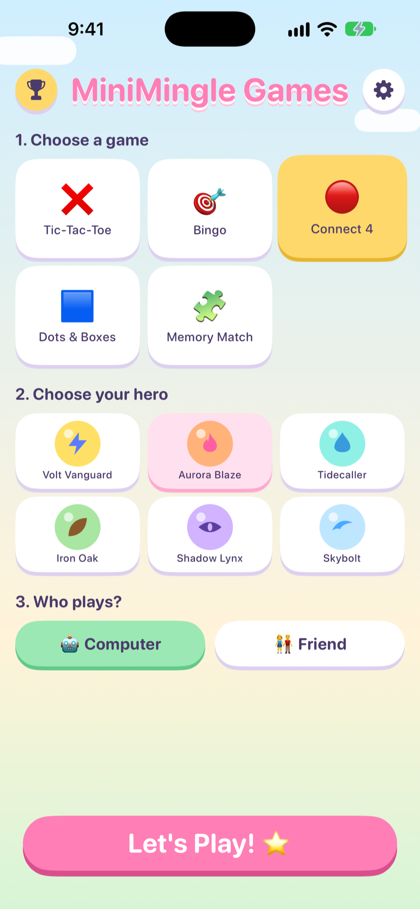
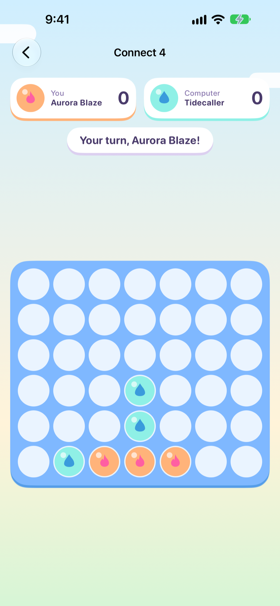
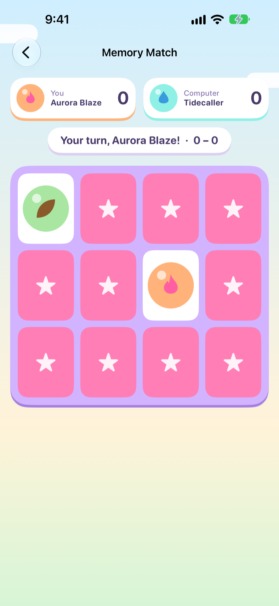
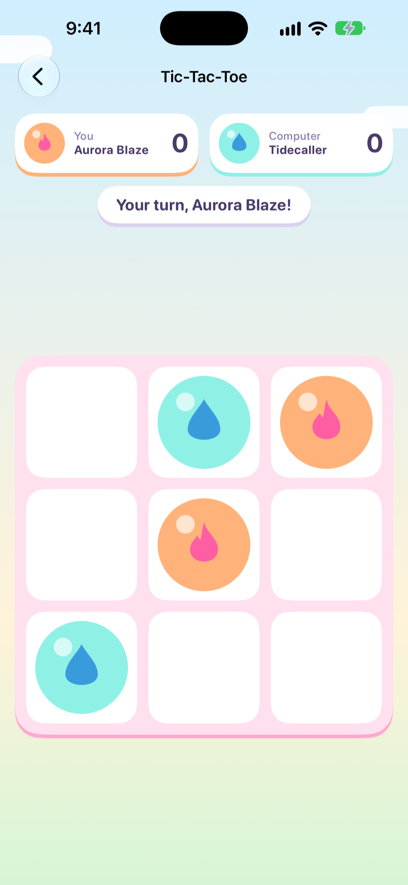
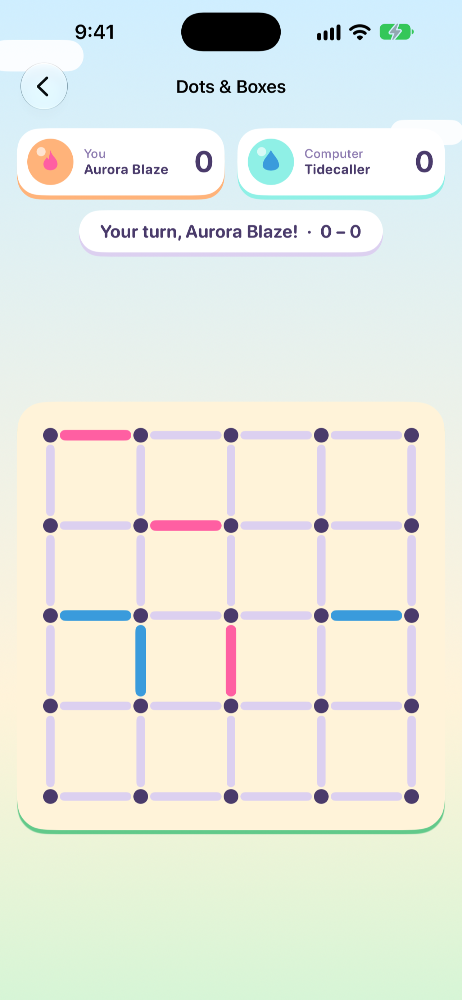
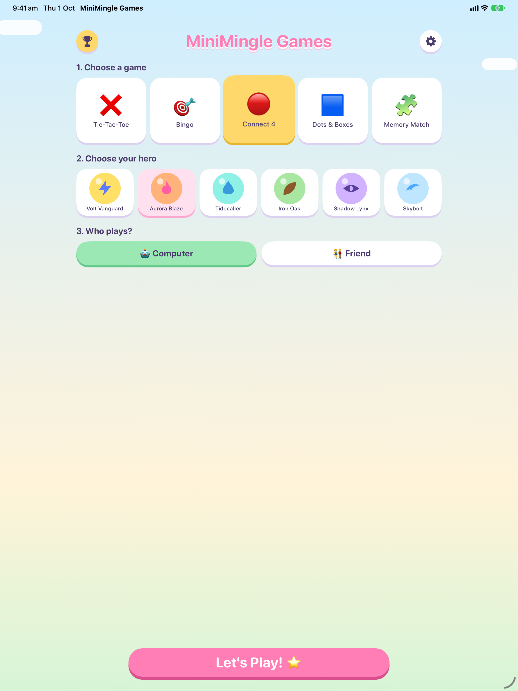
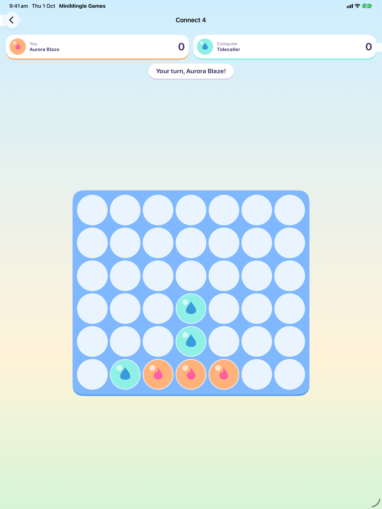

# 🎮 MiniMingle Games

**Five classic games, six cartoon heroes, and loads of fun — made just for kids.**

MiniMingle Games is a bright, bouncy SwiftUI app that brings favorite board and paper games to life. Pick a game, choose your hero, and play against a friendly computer opponent or pass the device to a friend. No ads, no accounts, no data collected — just fun.

<p align="center">
  
  
  
  
  
</p>

## ✨ Features

- **5 games to play** — Tic-Tac-Toe, Connect 4, Dots & Boxes, Bingo, and Memory Match
- **6 cartoon heroes** — Volt Vanguard, Aurora Blaze, Tidecaller, Iron Oak, Shadow Lynx, and Skybolt, each with their own color and emblem as game pieces
- **Play your way** — against the computer, or pass-and-play with a friend on the same device
- **Leaderboard** — track wins across games and heroes
- **Made for families** — a daily play timer lets grown-ups set how long kids play, and a parental gate protects Settings
- **Universal** — works on iPhone and iPad, in portrait and landscape
- **Offline & private** — no internet needed, no ads, no in-app purchases, no accounts, and no data ever leaves the device

## 🕹️ The games

| Game | Description |
|---|---|
| Tic-Tac-Toe | Get three in a row to win |
| Connect 4 | Drop discs and connect four |
| Dots & Boxes | Close the most boxes |
| Bingo | Call numbers and fill a line |
| Memory Match | Find the matching heroes |

## 📱 More screenshots

<p align="center">
  
  
</p>

## 🛠️ Tech stack

- **SwiftUI** for the entire UI, with `async`/`await` instead of Combine
- **UserDefaults** for all local persistence (scores, settings, play timer) — nothing is sent off-device
- Targets iOS 17+, built with Xcode

### Project structure

```
MiniMingle Games/
├── Games/                  Game boards & logic (Tic-Tac-Toe, Connect 4, Dots & Boxes, Bingo, Memory Match)
├── HomeView.swift          Game, hero, and opponent picker
├── ContentView.swift       Root navigation
├── AppState.swift          Shared app state
├── PlayTimeManager.swift   Daily play timer for parents
├── ParentalGateView.swift  Parental gate for Settings
├── LeaderboardView.swift   Win tracking
├── SettingsView.swift      Sounds, vibration, play timer settings
└── SplashView.swift        Launch screen
```

## 🚀 Getting started

1. Open `MiniMingle Games.xcodeproj` in Xcode
2. Select a simulator or device
3. Build & run (⌘R)

## 🔒 Privacy

MiniMingle Games collects no data. Everything — scores, settings, and preferences — stays on the device. See the [privacy policy](https://shruezee.github.io/MiniMingle-Games/privacy.html) for details.

## 📄 License

Copyright © 2026 ShruthiRamKum. All rights reserved.
